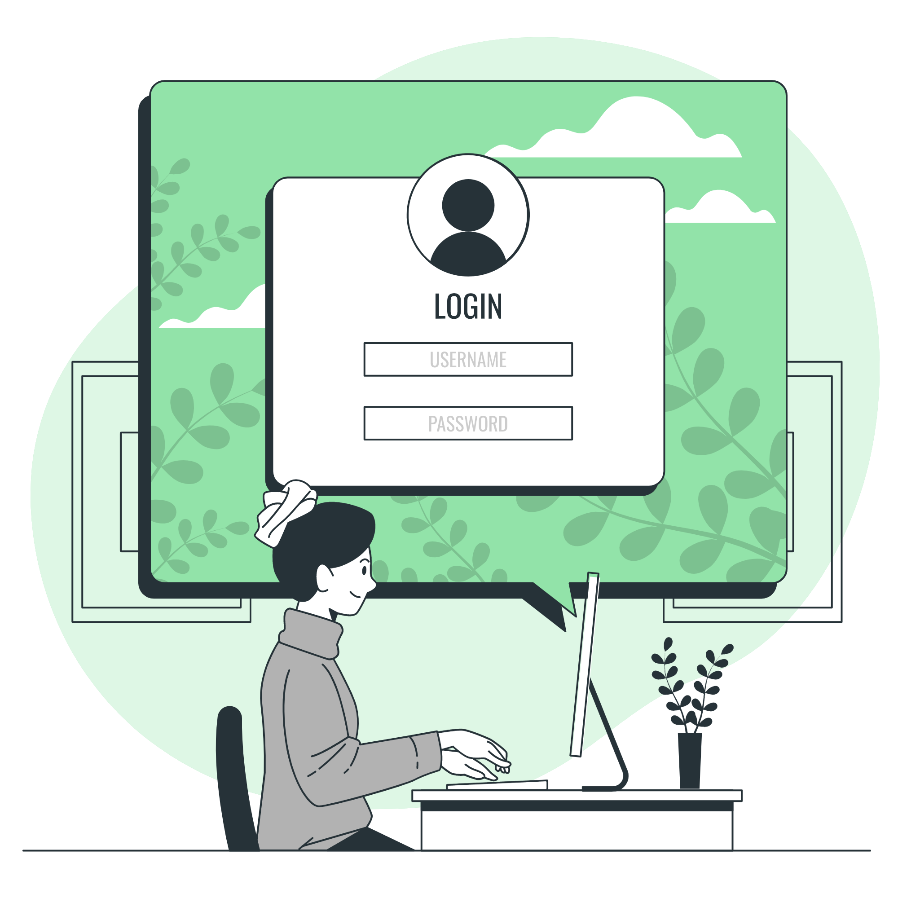

# Project4 - Login Site
## Hi My Name is **Bahaa Al-deen**

[Go to Live Link!](https://bahaa12edeen.github.io/Project4/)

***
## Introduction
After We Learn Set of Topics Like:

1. UI/UX
1. HTML5
1. CSS3
1. PHP

WE DO IT!

## Project Overview

Login and Sign up pages, you can use bootstrap for styling your pages, all the inputs should have validation in the frontEnd [regex] and the backend on both sides.

## Project Design

* We took into account that the page is responsive

1. Project Mockup & wireframe
   * [Mockup Link](https://miro.com/welcomeonboard/QzJTcFlTcGxqcmF5ODQyNDdGc0VhMUZ6ZUt1VmptU2FFR2tONkNKWTA0NmFpRFpqSjVhQjIxY044UkNPWFMzenwzNDU4NzY0NTE5NjMyMDE5MzQ4?share_link_id=574299763899)

1. Project Folder
   * [Repo Link](https://github.com/bahaa12edeen/Project4)

1. Live Code
   * [Live Link](https://bahaa12edeen.github.io/Project4/)